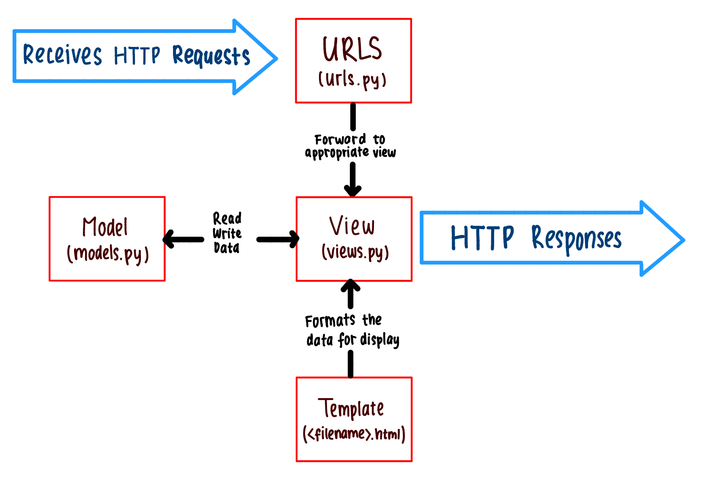

Name: Shelia Vellicita
Student ID: 2406453606
Class: PBD KI

Deployment link: https://shelia-vellicita-penaltee.pbp.cs.ui.ac.id/

--------------------------------------------------------------------------------------------------------------------------------------------

Assignment 2

1. Explain how you implemented the checklist above step-by-step (not just by following the tutorial).

My first step was to create and set up the Django project in a new GitHub repository:

I. Firstly, I created a new directory/folder on my laptop with my application name, which is "penaltee".

II. I opened Windows Powershell, typed 'cd', then dragged my penaltee folder to the Windows Powershell so it would change the directory into the penaltee directory. To initialise my Django project, I created a virtual enviroment by typing 'python -m venv env' so the application is independent meaning that it will not clash with other versions on the same computer. This virtual environment can be activated by typing the command 'env\Scripts\activate' and deactivated using 'deactivate'. Since I needed to set up the Django project, I activated the virtual environment in the Windows Powershell.

III. In the penaltee directory, I made a requirements.txt file filled with some dependencies. Then, I installed the dependencies by using the command 'pip install -r requirements.txt' in the Windows Powershell. Finally, I created the Django project using the command 'django-admin startproject penaltee .'

IV. For the next step, I opened the penaltee folder in Visual Studio Code to create a ".env" file for local development with 'PRODUCTION=False' and '.env.prod' file for production that includes PostgreSQL credentials (DB_NAME, DB_HOST, DB_PORT, DB_USER, DB_PASSWORD, SCHEMA) and PRODUCTION=True. Then, I modified settings.py to load these environment variables, set up ALLOWED_HOSTS for access control, added a PRODUCTION flag to switch between environments, and updated the database configuration.

V. Then, I ran the server by typing the migration command 'python manage.py migrate' in the Windows Powershell to set up the database. After the migration finished, I started the Django development server using the command 'python manage.py runserver'. Finally, I opened http://localhost:8000 in the browser to check whether it succeeded or not.

VI. After that, I created a GitHub repository named "penaltee" with public visibility. Then, I initialised the penaltee directory as a git repository using the command 'git init' in the Windows Powershell, which created the ".git" folder for tracking changes. After that, I added a ".gitignore" file to exclude unnecessary or sensitive files from version control. Next, I connected the local repository to the GitHub repository with the remote URL using 'git remote add origin <URL link>', created a main branch named master using 'git branch -M master', and performed 'git add .', 'git commit -m "Initial project"', 'git push origin master' which are commands to add, commit, add push so the project is uploaded to GitHub.

VII. Then, I logged in to PWS website to create a project named penaltee. In the project's Environment tab, I opened the Raw Editor, put the contents of my '.env.prod' file. Then, I updated my Django settings.py to include the PWS deployment URL in ALLOWED_HOSTS. I used the add, commit, push again to save the changes to GitHub. When I pushed to PWS, there is a window opened for us to fill the username and password from the project credentials. Finally, when my project's deployment status was 'Running', I can access my project on my deployment URL.

After finished setting up my Django project, I continued to create the inside of the project and decorated the template:

I. I started by creating a new application "main" inside the penaltee project using the command 'python manage.py startapp main'. Then, I added 'main' to the INSTALLED_APPS in the settings.py inside the penaltee directory to register the main application on the project.

II. Next, I made a new directory named "templates" inside the main application directory. Then, inside the templates directory, I created "main.html" file and filled the file with html codes to decorate the display.

III. After that, I modified the models.py inside the main application directory. I added the required attributes with their type from the assignment checklist. Then, I did migrations using the command 'python manage.py makemigrations' then 'python manage.py migrate'.

IV. The next step was to connect the view to the template. At the very top of the code in views.py inside the main application directory, I imported the render function from django.shortcuts and I created the "show_main" function, which takes a request as input, prepares a context dictionary containing values for the app_name, name, and class. Then I returned to the main.html to put the template variables.

V. Then, I needed to configure the URL routing. I created "urls.py" inside the main application directory where I typed the code to first import the path function from django.urls and the show_main view then define a URL pattern that mapped to the show_main function by setting app_name = 'main'. Next, I opened the urls.py inside the penaltee directory and typed the code to import the include function from django.urls then add the following URL route in the urlpatterns variable to direct requests to the main view.

VI. I ran the Django project using the command 'python manage.py runserver' then I viewed the page by opening http://localhost:8000

VII. Finally, I save all changes to GitHub and PWS by add, commit, and push to both origin master and pws master. Hence, my Django project was completed with the deployment url: https://shelia-vellicita-penaltee.pbp.cs.ui.ac.id/

2. Create a diagram showing the client request to the Django-based web application and its response, and explain the relationship between urls.py, views.py, models.py, and the HTML file in the diagram.

The diagram shows how a client request is handled in Django. First, when the user makes a URL request, then the urls.py checks the URL and forwards it to the right view in views.py. The view now will interact with the model (models.py) to read then write the necessary data from the database. Once the data is ready, the view returns the user an appropriate template from the HTML file which formats the retrieved data for display. Finally, Django gives the rendered HTML as an HTTP response to the client's browser.

3. Explain the role of settings.py in a Django project!

The settings.py is like Django project's control center that determines how Django runs and integrates its different components. The settings.py contains all configurations for a Django project to manage the application's behaviour within development, testing, and production environments including database connection, middleware, and security settings such as ALLOWED_HOSTS. In addition, it also manages media file paths and templates. Therefore, settings.py is essential for ensuring the project runs consistently and securely across different environments.

4. How does database migration work in Django?

Migration is the process of propagating the model changes into the database schema without the need to delete or recreate the entire database. The three step guide to making model changes are:

I. Modifying the models in models.py

II. Run 'python manage.py makemigrations' to create migrations for those changes

III. Run 'python manage.py migrate' to apply the changes to the database. 

Makemigrations creates migration files based on the model changes, meanwhile migrate actually applies those migration files to the database, hence it updates the schema accordingly.

5. In your opinion, among all existing frameworks, why is the Django framework chosen as the starting point for learning software development?

From my perspective, Django framework has many built-in features so it is easier for beginners to understand the concepts first rather than worrying about complex setups. Django is a good development practice and provides clear documentations, making it very convenient to use while also helping developers monitor and manage their development progress.

6. Do you have any feedback for the teaching assistant for Tutorial 1 that you previously completed?

Overall, the tutorial sessions have been going really well! However, I did encounter some difficulties with certain instructions, particularly when an early step involved migrate/makemigrate then the second step is about creating unit tests, and when I attempted to run it, some errors occurred because it turned out that I needed to migrate it again. This difficulty may not be the same for all students, as I am still trying to get familiar with Django and web development. 
Aside from this, the tutorials are great and the teaching assistants are very helpful, responsive, and provide clear guidance! Thank you kakak-kakak! 

--------------------------------------------------------------------------------------------------------------------------------------------

Assignment 3

1. Why do we need data delivery in implementing a platform?

Data delivery is the process of transferring data from one place to another. It is important in implementing a platform because it ensures that the right data gets to the right user in time. Platforms need real-time data delivery, timely updates, and efficient backend data retrieval. Those features cannot function without implementing a data delivery system. Data delivery also connects the frontend or user interface with the backend or database which is very crucial to create a dynamic and interactive platform. Therefore, data delivery acts like a backbone of functionality, performance, and user experience.

2. In your opinion, which is better, XML or JSON? Why is JSON more popular than XML?

Based on readability, JSON is easier to understand and work with the data format as it has a clearer code structure which makes it easier to read, debug, and spot errors. The reason is because JSON uses key-value syntax meanwhile XML uses nested tags that can be hard to scan at first glance.
JSON is more lightweight, making it ideal for web and mobile applications. In addition, its native compatibility with JavaScript and modern APIs boosts its popularity. On the other hand, XML is more complex and less suited for modern data exchange even though it is still useful for certain legacy systems and document-based structures.

3. What is the purpose of the is_valid() method in Django forms, and why do we need it?

The is_valid() method in Django forms is used to check whether the data submitted through the form is valid. This means that it will ensure the correct data type is submitted for each input and every required input fields are filled. When it is called, it will perform a comprehensive validation process on the submitted data. Therefore, it prevents processing or saving invalid data, automatically gives feedback to users when the inputs are incorrect, and ensure that the application works with safe and clean data.

4. Why do we need a csrf_token when making forms in Django? What can happen if we don't include a csrf_token in a Django form? How can this be exploited by an attacker?

The csrf_token needs to be included in forms so the server can verify that the request is coming from the authenticated user and not from a malicious source. If we don't use csrf_token, it can lead to serious security issues. The server won't be able to distinguish between valid requests and forged requests, so it might process the malicious request. An attacker can send a link to the authenticated user to submit an information, since there is no csrf_token, it will not match with the token generated for the user at the starting of the session, so it will throw a 403 Forbidden error page. By including a csrf_token, the server can only accept request with a valid token, preventing attackers from tricking users into submitting unauthorized actions.

5. Explain how you implemented the checklist above step-by-step (not just following the tutorial).

Firstly, I created a base template for the website as a consistent skeleton across all pages by adding a 'templates' directory in the main project folder and creating a 'base.html' file inside it that contains the essential HTML structure. Hence, it helps maintain the visual throughout the website. Next, I updated the template settings to include the path to the templates folder. 

Then, I created a form to add a new product by making a new file 'forms.py' in the main directory that will receive new product data. The data are models that have been made from the previous assignment, which are name, price, description, thumbnail, category, is_featured, specifying the fields of product model that will be used in the form. Then, I opened views.py to update and add some functions, which are modifying show_main so it can fetch all product objects that are stored in the database, making create_product to generate a form that can automatically add product data when submitted, and show_product to fetch product object based on its primary key (product_id) and if no object is found, a 404 page is returned. Then, I added URL paths to the urlpatterns in the urls.py file. 

After that, I updated the code in the main.html and inside the content block to display the product data along with the buttons "Add Product" and "Details". Next, I created an input form and product details page under the main/templates directory. Then, I added my PWS project URL entry to CSRF_TRUSTED_ORIGINS inside the settings.py in the root project directory. 

Next, I turned my Django data into APIs using XML and JSON. In views.py, I imported HttpResponse and serializers, created a show_xml function that retrieves all product objects, serializes them to XML, and returns the data with the proper content type. I added a URL pattern for that function in the urls.py so the XML data can be accessed at /xml/. Then, I created a similar show_json function to serialize and return the product data in JSON format and added its URL pattern at /json/ in urls.py.

After that, I made two functions, show_xml_by_id and show_json_by_id, which accepts a product_id to return specific product data in XML or JSON. I used try-except blocks to handle cases where the ID doesn't exist by returning a 404 response. Then, I added URL petterns with ID parameters to access those endpoints. Finally, I ran the Django server to test the XML and JSON endpoints, both for all data and individual product items by the ID.

Then, I did add, commit, push for all changes. For the last checklist, I put those link into Postman to check the results.

6. Do you have any feedback for the teaching assistants for Tutorial 2?

Teaching assistants were helpful but there were a lot of typos in the code for Tutorial 2 which created many errors and delays. However, they are still very nice and good. :D

Postman Screenshots:

--------------------------------------------------------------------------------------------------------------------------------------------

Assignment 4

1. What is Django's AuthenticationForm? Explain its advantages and disadvantages.

AuthenticationFrom in Django is the built-in form class for handling user login with fields for username and password. It is in 'django.contrib.auth.forms' and usually used with Django's autentication system, which is 'django.contrib.auth'. The main advantages are that it is secure, easy to use, integrates seamlessly with Django’s session and authentication system, and can be extended to fit specific needs while providing built-in error handling. However, it has limited customization, poor frontend styling, rigidity when utilizing custom user models with multiple IDs, and a lack of sophisticated security features, such as CAPTCHA or two-factor authentication. Although it is generally a practical and trustworthy place to start for authentication, projects with unconventional login procedures frequently need for customization.

2. What is the difference between authentication and authorization? How does Django implement the two concepts

Authentication verifies who a user is, while authorization determines what the user is allowed to do. In Django, authentication is implemented through the built-in User model, secure password handling, session management, and helper functions like authenticate() and login(), whereas authorization is performed using a system of permissions and groups associated with users, as well as tools like decorators and class-based mixins that restrict or allow access based on a user's permissions.

3. What are the benefits and drawbacks of using sessions and cookies in storing the state of a web application

Sessions are more secure and can handle larger amounts of data because sensitive information stays on the server, and work well with authentication systems since they save data on the server and simply record a session ID in the client's cookie. However, sessions increase server load and require proper session management. On the other hand, cookies store data directly on the client’s browser, which reduces server-side storage needs and allows quick access to small pieces of state, like preferences or tokens, but they are limited in size, can be manipulated by the user, and are more vulnerable to attacks if not secured properly. In conclusion, sessions are safer and better for sensitive or large data, while cookies are lightweight and efficient for small, non-critical client-side state, but each has constraints between security, scalability, and performance.

4. In web development, is the usage of cookies secure by default, or is there any potential risk that we should be aware of? How does Django handle this problem?

In web development, cookies are not secure by default because they are stored on the client’s browser and can be intercepted if sent over insecure connections or stolen/manipulated through attacks, so developers must take precautions. In order to prevent this, Django implements a number of security measures. These include setting session cookies to 'HttpOnly' by default so that JavaScript cannot access them, allowing cookies to be marked as 'Secure' to guarantee that they are only sent over HTTPS, offering CSRF protection through cookies with configurable security flags, and supporting cookies that are cryptographically signed to prohibit tampering. For optimal security, developers must still enable and configure settings like 'SESSION_COOKIE_SECURE', 'CSRF_COOKIE_SECURE', and 'SameSite'.  Therefore, even if cookies are dangerous by default, Django reduces them with built-in safeguards.

5. Explain how you implemented the checklist above step-by-step (not just following the tutorial).

Firstly, I prepared and activated the virtual environment, then opened views.py in the main app and imported UserCreationForm and messages. Then, I created a register function that returns a blank form on GET and processes form data on POST to initialize a form with UserCreationForm(request.POST), check validity with form.is_valid(), save the user, add a success message, and redirect to the login page. After that, I created a register.html template with {{ form.as_table }} and , then added the route path("register/", register, name="register") to urls.py.

For login, I imported AuthenticationForm, authenticate, and login in views.py. Then, I wrote a login_user function that initializes the form with POST data, validates it, retrieves the user, calls login(request, user), and redirects to the main page. For GET, I made a blank AuthenticationForm and rendered it to login.html. Thereafter, I added the route path('login/', login_user, name='login') to urls.py. For logout, I imported logout, created a logout_user function that calls logout(request) and redirects to login, then added a logout button in main.html and wrote the route path('logout/', logout_user, name='logout').

To restrict access, I imported login_required and added @login_required(login_url='/login') to functions like show_main and show_product. This will ensure only authenticated users can access them, and unauthenticated users will be redirected to the login page. For tracking last login, I modified the login_user to create a redirect response after login, set a cookie like last_login, and return the response. Then, I included the cookie to show_main in the context, displayed it in main.html, and updated logout_user to delete the cookie before redirecting.

To associate content with users, first I imported User from django.contrib.auth.models in models.py and added a foreign key field user = models.ForeignKey(User, on_delete=models.CASCADE, null=True) to the model. Since I modified the models.py, I ran migrations. In the create_product, after validating the form, I used form.save(commit=False), assigned the current user with entry.user = request.user, saved, and redirected it. In show_main, I made a filter between all objects and only the current user’s objects using a query parameter then updated the template to provide filter buttons. Therefore, it will display the author’s username if it exists, or “Anonymous” otherwise.

Finally, I ran the server and tested the flow of registering a new user, logging in, creating new objects that are tied to the logged-in user, confirming that the filter shows either all or only the current user’s items, checking that the last login time is stored and displayed from cookies, and confirming it is cleared after logout. Then, I created two user accounts on the website and made 3 products for each user.

--------------------------------------------------------------------------------------------------------------------------------------------

Assignment 5

1. CSS Selector Priority: If multiple CSS selectors target an HTML element, explain the priority order for CSS selector selection

When multiple CSS selectors target an HTML element, it would follow a priority order to determine which style to apply, where inline styles have the highest priority, followed by ID selectors, then class selectors, and lastly element selectors. Inline styles are styles that are written directly inside the tag of an HTML element using the 'style' attribute. They have the highest priority because they are applied specifically to that element. Next are ID selectors, which are used to style an element with a unique ID attribute. In CSS, they are written with a # symbol. Since ID selectors should be unique within a page, they carry the second strongest priority. The third one is class selectors that target elements that share the same class attribute, and they are written with a dot (.). Class selectors are reusable across multiple elements, giving them flexibility but slightly less weight than ID selectors. Finally, element selectors, which refer to HTML tags themselves, such as. They provide the broadest scope and therefore have the lowest level of influence in the hierarchy.

2. Responsive Design: Why is responsive design important in web application development? Provide examples of applications that have and haven't implemented responsive design. Explain the reasons behind your examples.

Responsive design is crucial in web application development because users access websites or applications on a wide variety of devices with different screen sizes, from mobile phones and tablets to laptops and large monitors. A responsive design ensures that the layout, text, and interactive elements automatically adapt to the screen size. Providing a consistent and user-friendly experience. Without responsive design, users may face issues such as unreadable text, buttons that are too small to click, or cards that are cropped, which can discourage engagement. 

For example, consider the difference between the old version of Instagram and the updated version. In the past, Instagram’s layout was not optimized for tablets. Instead of adapting to the larger screen, it simply displayed the mobile version, which was designed for a narrower 16:9 phone display. As a result, when users opened Instagram on a tablet, especially in landscape orientation, the content appeared shrunken, leaving empty space on the sides, and making the interface uncomfortable to use. In contrast, the new Instagram update has introduced a responsive layout for tablets. The design now includes side navigation bars and restructured content that scales appropriately to the wider display, making text and buttons easier to read and interact with. Therefore, Instagram has made the application now comfortable to use on every device. This improvement highlights the importance of responsive design in enhancing usability.

3. Box Model: Explain the differences between margin, border, and padding, and how to implement them

The CSS box model consists of margin, border, and padding, they each control different spacing around an element. Margin is the space outside the element that separates it from others, and it can be set using 'margin: 30px;'. Meanwhile, border is the outline that surrounds the padding area and encloses the element's content, for example 'border: 2px solid black;'. Lastly, padding is the space inside the element between the content and the border, which can be added with padding: 10px;. Together, they define how an element is displayed in relation to its content and surrounding elements, as illustrated in the picture below.

4. Layout Systems: Explain the concepts of flexbox and grid layout along with their uses

Flexbox and grid are two CSS layout systems that make arranging elements easier and more flexible. Flexbox is designed for one-dimensional layouts, meaning it works best when aligning items in a single row or a single column. It is useful for creating responsive navigation bars, centering elements, or evenly spacing items. On the other hand, grid layout is two-dimensional, allowing developers to control both rows and columns simultaneously. It is ideal for designing full-page layouts, image galleries, or complex structures where items need to align both vertically and horizontally. In short, Flexbox is best for simpler, linear arrangements, while grid is more powerful for structured and multi-dimensional layouts.

5. Implementation Steps: Explain how you implemented the above checklist step-by-step (not just following the tutorial)

In this assignment, I used Tailwind to design my Django application. I began by modifying the base.html file in the templates folder, where I added the <meta name="viewport"> tag so the page could adapt to mobile devices and ensure a responsive design. I also connected Tailwind to the template by including its CDN script.

Next, I implemented two functions, which are edit and delete. The edit function allows users to update their own product details, while the delete function removes products they created. I wrote the logic for these features in views.py, created edit_product.html and delete_product.html, and defined their paths in urls.py. I also updated main.html to include buttons for editing and deleting products.

Afterward, I designed a navigation bar by creating a navbar.html file in the templates folder. I built the visual structure of the navbar there and then linked it to main.html using Django’s  tag so it appears consistently across the app.

To configure static files, I added the WhiteNoise middleware in settings.py right below SecurityMiddleware, which enables Django to serve static files in production. I also set up the STATIC_URL, STATICFILES_DIRS, and STATIC_ROOT variables. Then, I created a 'static' folder in the root directory with a 'css' subfolder. In the css folder, I placed a global.css file for custom styles. This stylesheet was linked in base.html so its rules could be applied throughout the templates.

Finally, I explored CSS and HTML by finding resources online to deepen my understanding and then applied that knowledge to design each page of my application.
